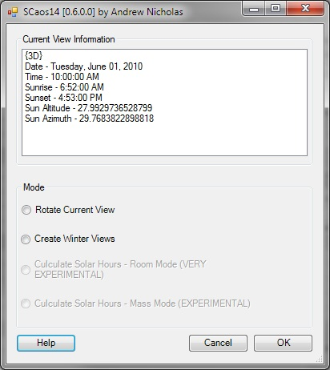

# SCaos - SC  Angle of Sun Add-in  #

## Summary ##

SCaos is a Revit addin that will rotate one, or many isometric views so that each view's camera is at the location of the sun.

SCaos will work with Revit versions 2013, 2014

## Modes ##

#### 1. Rotate Current View ####

This mode will rotate the current view (if it is a isometric view).

**NOTE:**  The user needs to set the time, date and location settings before running this.

#### 2. Create Winter Views ####

This will automagically create Solar Access views for the following times in Winter:

    1. June 21st 9am  
    2. June 21st 10am  
    3. June 21st 11am  
    4. June 21st 12pm  
    5. June 21st 1pm  
    6. June 21st 2pm  
    7. June 21st 3am  

New views will be named:

    SOLAR ACCESS - [TIME] JUNE 21

#### Create Solar Hours (Room Mode) ####

N/A

#### Create Solar Hours (Mass Mode) ####

N/A

